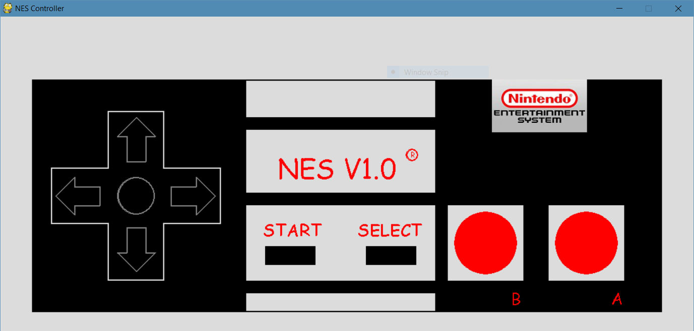
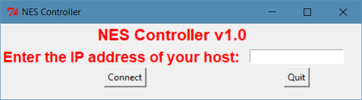

# NESController
A simple PyGame rendered NES Controller looking interface which can be used to send data via a UDP Socket.

## What is this?
This is a simple interface which tries to recreate the NES Classic controller look. This is rendered using pygame. It also has code to send data via a UDP socket. This can be read at a specific address and port so as to actually create a controller by interpreting and consuming the data. It also uses the tkinter library to create a basic user interface for taking the IP address and port of the host.

_NOTE: This code has the provision to send data via a udp socket. Do not look at this as a networking programming example but more of a simple PyGame example._

## How to run?
* Install pygame - [PyGame Documentation](https://www.pygame.org/docs/).
* Install tkinter - [Tkinter Webpage](https://docs.python.org/2/library/tkinter.html).
* Run the controller_red.py file.
* Enter a IP Address. (Skip this if you do not have a host.)
* Press connect.

## Screenshots
NES Classic Controller UI

Input UI

## Legend
* W = Forward
* A = Left 
* S = Backward 
* D = Right 
* K = B 
* L = A
* I = Select (Shows Legend on Hold) 
* O = Start (Shows Legend on Hold)